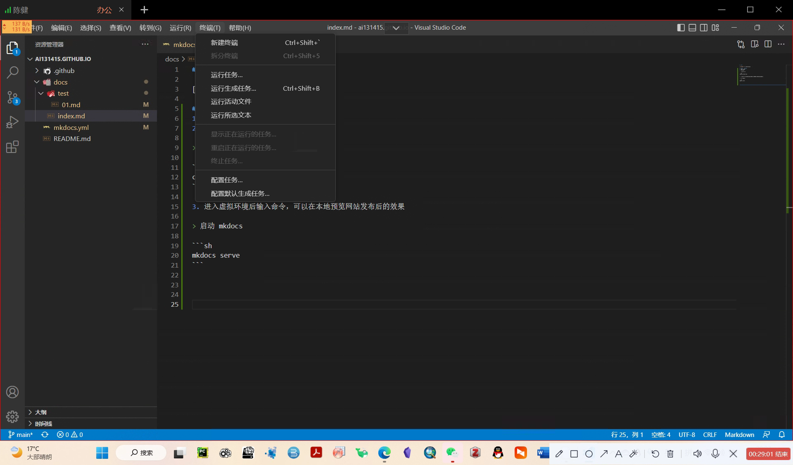
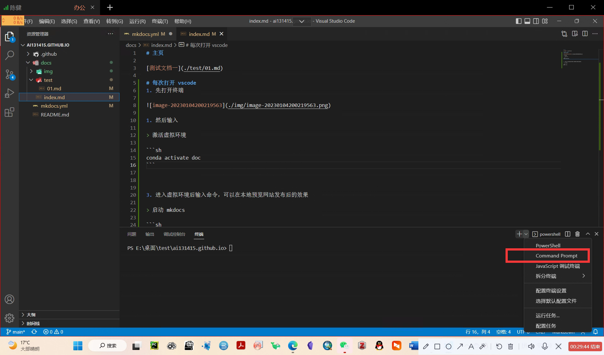
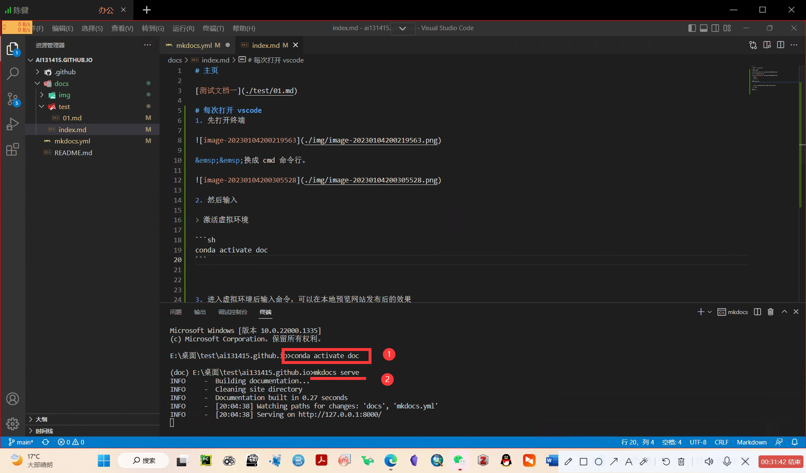

### 主页

[测试文档一](./test/01.md)

### 每次打开 vscode 
1. 先打开终端



&emsp;&emsp;换成 cmd 命令行。



2. 然后输入

> 激活虚拟环境

```sh
conda activate doc
```

3. 进入虚拟环境后输入命令，可以在本地预览网站发布后的效果

> 启动 mkdocs 

```sh
mkdocs serve
```



### 使用技巧

&emsp;&emsp;比较常用的都在这个文档里了，`ctrl+/` 可以对比查看源码和现在的显示效果进行对比。`ctrl + C` 就可以停掉 vscode 的程序。


 ***!!记得激活*** 